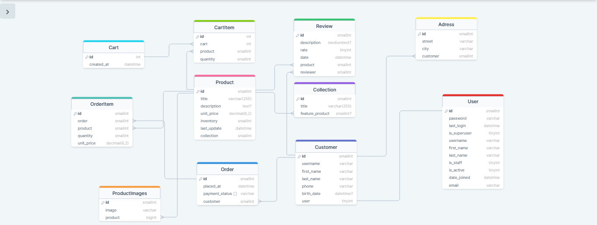

# Ecommerce-Api

this is the complete backend project for Ecommerce store. It mimics the complete Ecommerce API behaviour.

## About

This eCommerce backend application is built using Dajngo and the Django Rest Framework framework. It provides a RESTful API for managing products, orders, and customers in an online store.

## Features

- User authentication and authorization using JSON Web Tokens (JWT)
- User registration and password reset functionality
- Email confirmation for password reset
- CRUD operations and more complex operations for managing products, orders, and customers
- paginate the products endpoint
- filtering and searching on the products endpoint
- File upload functionality for product images

## Technologies Used

- Django
- Django REST Framework
- MySql

## Prerequisities

To be able to run the project successfully you need to have the following installed on your machine:

1. python
2. pipenv
3. MySql

You can install python and MySql from their official website.\
You can install pipenv using this command `pip install pipenv`

## How to run?

1. Clone this repository
2. Activate the virtual environment: `pipenv shell`
3. Install dependencies: `pipenv install`
4. Create and Configure the database as mentioned in [**Database Creation and Configuration**](#database-creation-and-configuration) section.
5. Run migrations: `python manage.py migrate`
6. seed the database if you would like to, as refered to in the [**Database Seeds**](#database-seeds) section.
7. create a superuser (admin) if you would like to, using command `python manage.py createsuperuser`
8. Start the server: `python manage.py runserver`

Please make sure to install all the prerequisities listed above in the [**Prerequisities**](#prerequisities) section.

## Database Creation and Configuration

you need to create a MySql Database on your machine with specific name and password and configure it in the `storefront/settings/dev.py` file.

```yaml
DATABASES = {
    'default': {
        'ENGINE': 'django.db.backends.mysql',
        'NAME': 'your database name',
        'USER': 'root',
        'PASSWORD': 'your database password',
        'HOST': 'localhost',
    }
}
```

replace the name and password with your own name and password

## Database Seeds

To seed an empty database before running the project you should run `python manage.py seed_db`, this will use the prewritten seeds stored in \
`store/management/commands` to seed your local database and create a group of products and collections

## API Documentation

I use `Postman` for generating the API documentation, so the documentation is hosted on a [API Documentation](https://documenter.getpostman.com/view/24318609/2s93JwMghA) and not locally.

## Database Modeling

This eCommerce backend application uses a MySql database with the following tables.

view it online: [DB Model](https://dbdiagram.io/d/6062e295ecb54e10c33de73e) .


